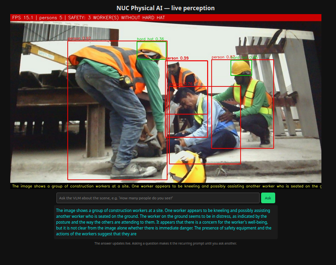
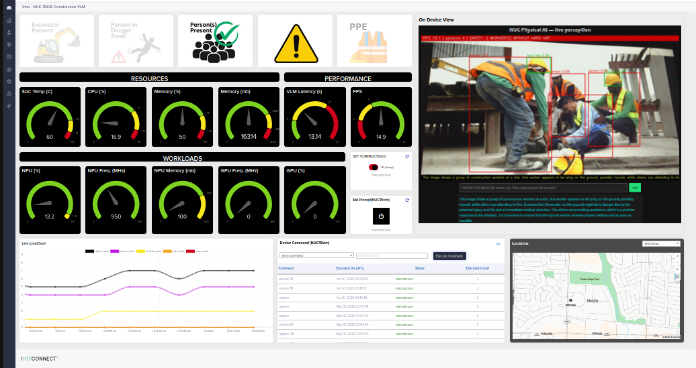

# NUC Physical AI — Construction Safety Demo: Full Overview

A self-contained **physical AI** demo: an Intel Core Ultra NUC watches a scene
through a webcam, understands it with two on-device AI models, streams safety
telemetry to Avnet **/IOTCONNECT**, answers questions about what it sees, and
**acts on the physical world** — lighting a warning LED on a separate IoT
device whenever it judges the scene hazardous. No frame ever leaves the device;
only telemetry, text and commands cross the network.



## 1. Physical setup

```
┌────────────────┐   HDMI    ┌─────────────────────────────┐
│ slideshow PC / │──────────▶│ Monitor: looping slide show │
│ media player   │           │ construction & mining scenes│
└────────────────┘           └──────────────▲──────────────┘
                                            │ Logitech BRIO (mounted
                                            │ inverted, HW-zoomed so the
                                            │ screen fills the frame)
                             ┌──────────────┴──────────────┐
                             │ Intel NUC (Core Ultra)      │
                             │ NPU: YOLO-World detector    │
                             │ iGPU: Qwen2.5-VL 7B (VLM)   │
                             │ Docker container            │
                             └───────┬─────────────┬───────┘
                       MQTT/X.509    │             │  local MCP (REST bridge)
                             ▼                     ▼
                    /IOTCONNECT cloud ───C2D──▶ PSoC6 kit: user LED
                    dashboard, commands         = physical warning light
```

- **The camera faces a monitor running a slide show** of construction and
  mining scenarios (workers, PPE, excavators, haul trucks, loaders…). Each
  slide is a fresh "scene" for the pipeline — hazards appear and clear as the
  deck loops, which continuously exercises detection, VLM judgment, telemetry
  and the warning light without anyone staging a real site.
- The BRIO is mounted upside-down and hardware-zoomed/panned so the slide
  content fills the frame (`CAMERA_ROTATE=180`, `CAMERA_ZOOM=185`,
  `CAMERA_PAN=7200` in `.env` — re-tune if the rig moves; the app re-applies
  these on every camera open, so they survive reboots).
- A **PSoC6 kit** (`psoc6-irm-f5af1c48` in /IOTCONNECT) acts as the site
  warning light via its `board-user-led` command.

## 2. Perception pipeline (all on-device, OpenVINO)

Two models on two different accelerators, so they never contend. All models
are baked into the container image (nothing downloads at the venue).

### Models on this NUC — measured 2026-07-11, 1080p capture

| Model | Type / quant | Runs on (default) | Role | Measured performance | How to select |
|---|---|---|---|---|---|
| **YOLO-World v2-m @ 800px**, construction classes baked at export | Open-vocabulary detector, OpenVINO | **NPU** | Fast path: person, hard hat, safety vest, excavator, dump truck, wheel loader, traffic cone, barrier (+synonyms canonicalized/deduped) | ~8 ms/frame (≈124 FPS of NPU headroom); the live pipeline is **camera-bound at ~15-30 FPS** | `DETECTOR_MODEL=/app/models/construction_openvino_model` (default) |
| YOLO11n (COCO 80 classes) | Generic detector, OpenVINO | NPU | Fallback when generic object detection is wanted (no PPE classes → safety rules degrade) | Smaller than YOLO-World; also far above camera rate | `DETECTOR_MODEL=/app/models/yolo11n_openvino_model` |
| **Qwen2.5-VL-7B INT4** | Vision-language model, OpenVINO GenAI | **iGPU** | Default judge: `HAZARD: YES/NO` + scene description, free-text Q&A. Noticeably sharper reasoning | **~7.5-8 s / answer** | default; `set-vlm 7b` to return to it |
| Qwen2-VL-2B INT4 | Vision-language model, OpenVINO GenAI | iGPU | Fast judge for snappier demos; less nuanced answers | **~3 s / answer** steady (~5 s first answer right after a swap) | `set-vlm 2b` cloud command / dashboard toggle |

**Placement options:** detector `DETECTOR_DEVICE=intel:npu|intel:gpu|intel:cpu`
(falls back NPU→GPU→CPU automatically); VLM `VLM_DEVICE=GPU|NPU|CPU|AUTO`.
The NPU-detector/iGPU-VLM split is what keeps detection smooth while the VLM
thinks.

**Knobs that shape VLM latency:** frames are downscaled to `VLM_MAX_SIDE=1024`
for the VLM only (the 7B was ~35 s/answer at full 1080p before this — a 5×
win; the detector always sees full resolution); answers are capped at
`VLM_MAX_NEW_TOKENS=150`. Hot-swapping models (`set-vlm 2b|7b`) takes ~10-30 s
and detection keeps running throughout.

A temporal smoother holds flickering detections so labels don't strobe near
the confidence threshold.

### Safety logic — two independent hazard paths

**Detector rules** (every frame, `app/safety.py`):
- *Missing PPE*: `person_count − hardhat_count` → "N worker(s) without hard hat"
- *Danger zone*: any person box overlapping any machinery box inflated by 5%
  of the frame → "worker in machine danger zone"
- `excavator_present` is true for **any** heavy machinery (excavator, dump
  truck, wheel loader, bulldozer…) — the name is kept for dashboard
  compatibility.

**VLM judgment** (every ~15 s): the recurring prompt is a structured safety
check; the first line `HAZARD: YES/NO` is parsed into the `hazard_detected`
telemetry flag. Ad-hoc questions don't overwrite the flag.

The two paths cross-check each other — the fast rules catch events instantly,
the VLM adds reasoning (and catches things box logic can't). Note the VLM is
deliberately conservative: a dark/blank monitor is reported as
`HAZARD: YES (scene too dark to assess)`, which also lights the warning LED.

## 3. Cloud: /IOTCONNECT

- **Telemetry every 10 s** (device `mclNUC16` template family): detection
  counts, PPE compliance, danger-zone and hazard flags, VLM scene text +
  latency, FPS, and hardware health (CPU/mem/SoC temp, GPU/NPU frequency and
  utilization), plus geo location.
- **Cloud-to-device commands**: `capture` (run VLM now), `ask-vlm <question>`,
  `set-prompt <text>`, `set-vlm 2b|7b` (hot-swap model in ~10-30 s).
- **Dashboard**: status tiles, gauges, live view embed, map
  (`dashboards/nuc-vlm-dashboard.json`).



## 4. Acting on the world: hazard → warning light

`app/hazard_actions.py` — deterministic, no LLM in the loop:

1. Watches both hazard paths (`HAZARD_SOURCE=detector|vlm|any`).
2. On a **rising edge** → sends `board-user-led on` to the PSoC6 —
   **LED lights the moment a hazard slide appears**.
3. After the scene stays clear for 10 s (`HAZARD_OFF_DELAY_S`) → `off`.
   The debounce stops the looping deck from strobing the light.

Plumbing: the container calls the **/IOTCONNECT MCP server**
(`iotc-mcp-server`, a systemd user service on the NUC bound to the Docker
bridge only) which wraps the REST API — that's what lets one *device* send
commands to another. The bridge can only ever send the single allowlisted
command to the single configured device (`HAZARD_LIGHT_*` in `.env`).

The same MCP server is agent-ready: point Claude/Strands (or the on-device
LLM) at it and the demo's commands become agent tools — see the genai-flow
demo on the FRDM i.MX95 for that pattern with voice.

## 5. Local viewer

`http://<nuc>:8080` — MJPEG stream with detection overlays, FPS/safety banner,
the latest VLM text, and an **Ask** box that sends any question to the VLM
about the live scene (great for audience participation: "how many trucks do
you see?").

## 6. Running it

See **`start-demo.txt` on the Desktop**. Short version: it auto-starts with
Docker on boot; `cd ~/dev/safety && docker compose up -d` / `docker compose
down`; logs via `docker logs -f physical-ai`. Give it ~60 s after boot for
models to load. Do **not** `docker compose pull` (the local image is newer
than the registry).

Key `.env` knobs: camera framing (`CAMERA_*`), model devices
(`DETECTOR_DEVICE=intel:npu`, `VLM_DEVICE=GPU`), cadences (`VLM_INTERVAL_S`,
`TELEMETRY_INTERVAL_S`), hazard bridge (`HAZARD_*`), viewer port.

## 7. Deployment variants

- **Standalone** (this rig): Docker Compose, X.509 direct MQTT to
  /IOTCONNECT. Credentials mounted, never baked into the image.
- **AWS Greengrass v2**: the same app ships as a Greengrass Docker-application
  component (`greengrass/`) — the Nucleus owns the cloud connection and OTA
  deployments; telemetry rides its IPC under the core device identity.
- **Ubuntu Core**: scaffolding in `core/` (untested; kernel snap is the risk).

## 8. Talking points

- **Two models, two accelerators, one 40 W box** — real-time detection *and*
  VLM reasoning don't fit in one model; splitting roles is the architecture.
- **Perception → judgment → physical action**, fully closed loop, with the
  cloud in the loop for fleet visibility and control but not on the critical
  path.
- **Edge privacy**: video never leaves the device; only telemetry and text do.
- The MCP bridge is the on-ramp to the **agentic story** (Strands/Bedrock:
  cloud agents that interrogate the site through `ask-vlm` and act through
  allowlisted commands).
